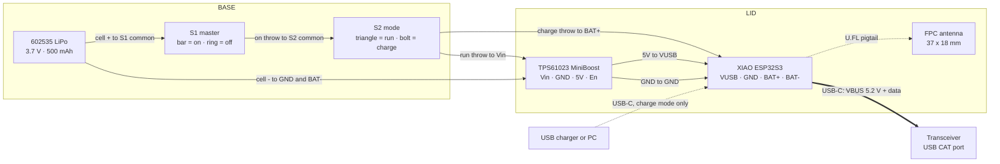

# PocketCAT — wiring

Two SS12F15G5 switches in series-with-mode arrangement. **S1** is the
master on/off; **S2** selects run or charge. Because S2 is SPDT, the boost
and BAT+ can never be live at the same time — the illegal state does not
exist in the wiring.

The sketch is the quickest way to see the topology; the
[connection table](#connections) below is the authority for what solders
to what. (The drawing letters the boost "TSP61023" — the part is the
**TPS61023**.)

## States

| S1 | S2 | Result |
|---|---|---|
| ring (off) | either | Cell fully isolated. True off. |
| bar (on) | triangle (run) | Boost powers the XIAO and drives VBUS for the radio. BAT disconnected, so the charger has nothing to loop into. |
| bar (on) | bolt (charge) | Cell on BAT+, boost dead. Plug the USB-C into a charger or PC to charge and reflash. |

All three reachable from outside the case.

## Connections

| # | From | To | Pair with | Notes |
|---|---|---|---|---|
| 1 | Cell **+** | S1 **common** | 4 | Cut the JST plug off |
| 2 | S1 **on throw** | S2 **common** | — | Both switches sit in the right bay |
| 3 | S2 **run throw** | Boost **Vin** | 4 | Crosses the divider rib at y 12.6 |
| 4 | Cell **−** | Boost **GND** | 3 | |
| 5 | S2 **charge throw** | XIAO **BAT+** | 6 | Crosses the rib at y 34.6 |
| 6 | Cell **−** | XIAO **BAT−** | 5 | |
| 7 | Boost **5V** | XIAO **VUSB** | 8 | VUSB is marked 5V on the top side |
| 8 | Boost **GND** | XIAO **GND** | 7 | Pin next to VUSB. Land both grounds on the boost pad, not chained through the XIAO |
| 9 | Boost **En** | Boost **Vin** | — | Short link on the module |

S1's second throw goes nowhere. That open position is the off state.

## Why BAT and VUSB must never both be live

VUSB is the VBUS node. The XIAO ESP32S3 carries a full battery management
system that starts charging whenever it sees USB power, and it cannot
distinguish the boost from a wall charger.

With the cell on BAT and the boost driving VUSB you get a loop —
cell → boost → charger → cell — through two conversion stages, bleeding
roughly 30–50 mA continuously while the cell never gains charge. Seeed
flag the same hazard from the other direction, recommending a blocking
diode when feeding the 5V/VBUS pin.

S2 makes this arrangement impossible rather than merely discouraged.

## Practical notes

**Twist every pair** per the table. Loop area is what radiates, and this
converter runs PFM at your load — bursty and variable-frequency, the hard
kind of noise to notch out of an HF receiver.

**Wire gauge.** 22 AWG silicone fits the anchors and channels. 26 AWG is
electrically ample — the boost draws about 160 mA at the input for a
100 mA CAT link — and routes far more easily in a case this size.

**Strain relief.** Hot glue over the VUSB, GND and BAT joints, then dress
the leads through the anchor posts. Those are surface pads with no
through-hole anchorage.

**En.** Tie it to Vin on the module. The clone may not carry Adafruit's
pull-up, and a floating enable on the TPS61023 is undefined.

**Output is 5.2 V**, deliberately high to offset cable drop. Within USB
tolerance at the far end.

## Routing through the case

| Run | Path |
|---|---|
| Cell + to S1 | Divider rib notch at y 12.6 |
| S1 to S2 | Along the right bay, no crossing |
| S2 run throw to boost Vin | Rib notch at y 12.6 |
| S2 charge throw to BAT+ | Rib notch at y 34.6 |
| Cell − to boost GND | Open space above the cell |
| Boost 5V and GND to XIAO | Twin end-stop channels at x 10.6–14.1 and 16.1–19.6 |
| Cell leads to XIAO | Wire escape channel at y 12.6–15.6, then the anchor posts |
| U.FL pigtail | Pocket gap at y 20.9–23.5, then the guide posts at x 34 |

Allow **60 mm** per run so the lid lies flat beside the base during
service.
